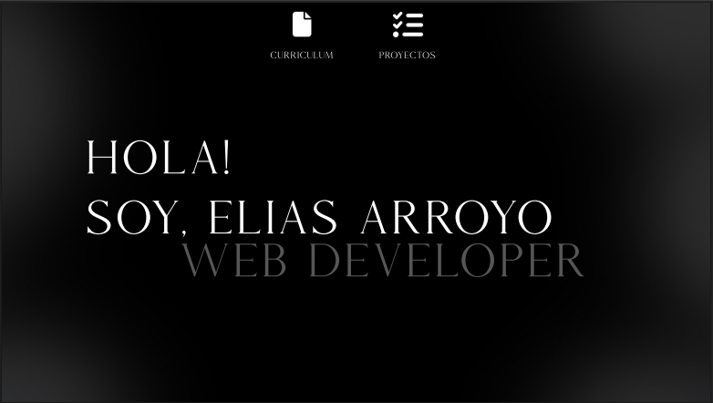

# 🎨 Elias Arroyo – Diseñador UX/UI | Diseñador Gráfico | Desarrollador Web

¡Hola! Soy Elias Arroyo, un diseñador multidisciplinario apasionado por crear experiencias digitales intuitivas y visualmente atractivas. Combino mis habilidades en diseño gráfico, UX/UI y desarrollo web para transformar ideas en productos funcionales y estéticamente agradables.

## 🖼️ Vista previa



> 📍 Basado en Guernica, Buenos Aires, Argentina

## 🚀 Tecnologías y herramientas


## 📁 Estructura del proyecto

- `index.html`: Página principal del CV
- `/style/`: Hojas de estilo CSS
- `/js/`: Scripts JavaScript
- `/img/`: Imágenes y recursos visuales
- `favicon.zip`: Íconos personalizados para el sitio

## ▶️ Cómo visualizar el CV

1. Clona el repositorio:
   ```bash
   git clone https://github.com/devlad-ar/CV-2025.git
